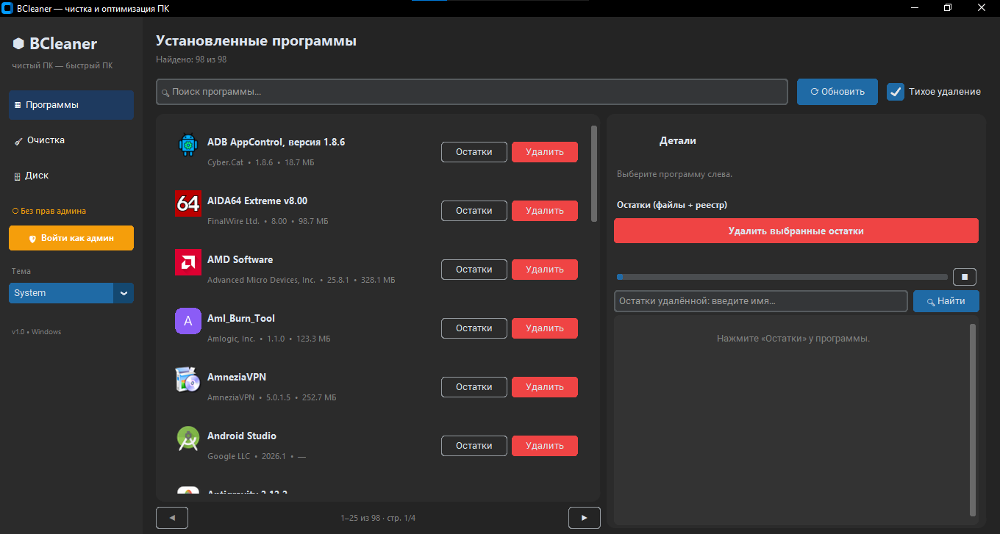

# BCleaner
Современный cleaner для Windows: удаление программ с поиском остатков, чистка мусора, аналитика диска. Тёмная / светлая тема.



## Возможности
- **Программы**: список из реестра (HKLM/HKCU, x64/x32), поиск, тихое/обычное удаление, поиск остатков (файлы + реестр) и их удаление.
- **Очистка**: Windows Temp, User Temp, Prefetch, Корзина, Delivery Optimization, логи, WER-отчёты, thumbnail-кэш, shader-кэш, кэши Chrome/Edge/Firefox.
- **Диск**: использование дисков, сканирование папки/диска, топ папок, drill-down, крупные файлы, treemap.

## Запуск
```powershell
python -m venv .venv
.\.venv\Scripts\Activate.ps1
pip install -r requirements.txt
python main.py
```

Для полного доступа (Prefetch, Windows Temp, корзина) запускайте от имени администратора.

## Сборка в .exe
```powershell
pip install pyinstaller
pyinstaller --noconfirm --clean --windowed --onefile --name BCleaner `
  --icon assets\icon.ico --add-data "assets;assets" --collect-all customtkinter main.py
```
Готовый файл: `dist\BCleaner.exe` (один файл, запускается без Python).

## Безопасность
- Перед удалением остатков и чисткой всегда спрашивается подтверждение.
- Реестр удаляется только из веток `SOFTWARE\<Имя>` и `Uninstall\<key>` текущего найденного приложения, с подтверждением.
- Системные записи (SystemComponent, ParentKeyName) скрыты по умолчанию.
